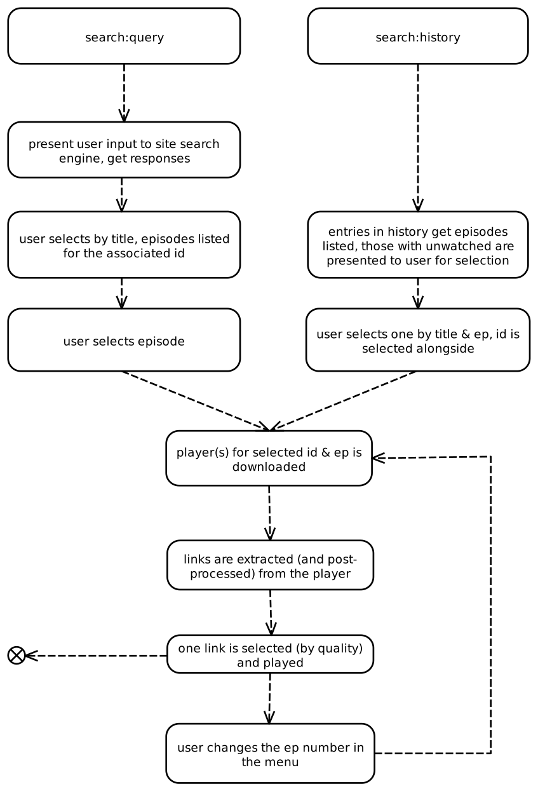
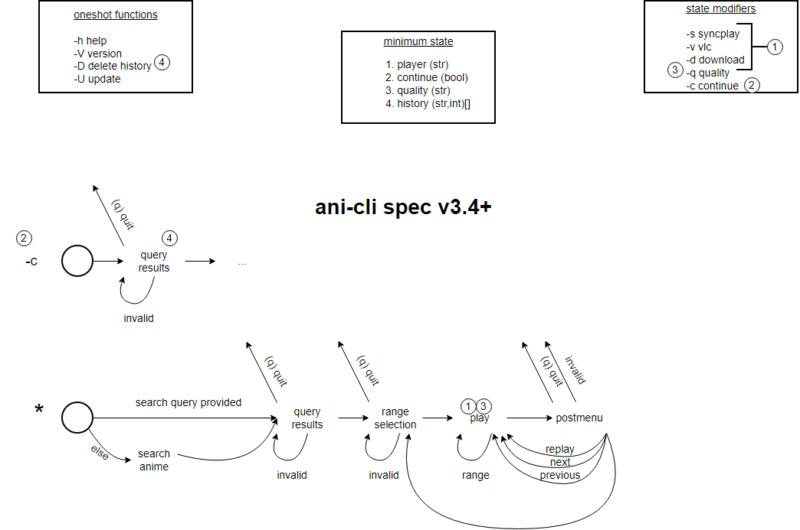

# Hacking ani-cli
Ani-cli is set up to scrape one platform - currently allanime. Supporting multiple sources at a time would require more changes than we (the maintainers) find worth doing, for this reason any feature request asking for a new site is rejected.

However ani-cli being open-source and the pirate anime streaming sites being so similar you can hack ani-cli to support any site that follows a few conventions.

## Prerequisites
Here's the of skills you'll need and the guide will take for granted:
- basic shell scripting
- understanding of http(s) requests and proficiency with curl
- ability to read html and javascript on a basic level and search them
- writing regexes
You'll also need web browser with a debugger and environment that can run unmodified ani-cli

## The scraping process
The following flowchart demonstrates how ani-cli operates from a scraping standpoint:

The steps to get to a link from a query is the following:
1. search with the site's search page for the query
2. extract IDs from response, user chooses one
3. extract episode numbers from an overview page, user chooses one
4. download player(s) for that id+episode number combination, extract links
5. quality selection selects one that is played
From here 1-4 need to be changed to support another site. #Reverse-engineering will answer how.

## Reverse-engineering
Many sites have various protections against reverse-engineering.
The extension webapi-blocker can help you with bringing up the debugger that we'll use during this guide or to conceal the presence of a debugger.
These reverse-engineering protections are always evolving though so there's no silver bullet - you'll have to do your own research on how to get around them.

An adblocker can help with reducing traffic from the site, but beware of extensions that change the appearance of the site (eg. darkreader) because they can alter the html/css.

Once you have the pages (urls) that you're interested in, it's easier to inspect them from less/an editor.
The debugger's inspector can help you with finding what's what but finding patterns/urls is much easier in an editor.
Additionally the debugger doesn't always show you the html faithfully - I've experienced some escape sequences being rendered, capitalization changing - so be sure you see the response of the servers in raw format before you write your regexes.

### Core concepts
If you navigate the site normally from the browser, you'll see that each anime is represented with an URL that compromises from an ID (that identifies a series/season of series) and an episode number.
The series identifier is stored in the `id` variable by the script and the episode number in the `ep_no` number.

Each episode has an embedded player that contains the links to the videos to be played.
Your goal is to get these links along with the resolution (quality) of the streams.
The embedded player has a separate URL from the episode page, but you can always get there from the episode page (and in some cases just by knowing the id and the episode number).

### Searching
The search page is usually easy to find on these websites. The searching method varies.
Some sites will have you post a database query in plaintext, some just use a get request with a single variable.
Just try searching for a few series and see how the URL changes (most of the times the sites use a get request for this purpose).
If the site uses a POST request or a more roundabout way, use the debugger to analyze the traffic.

Once you figured out how searching works, you'll have to replicate it in the `search_anime` function.
The `curl` in this function is responsible for the search request, and the following `sed` regexes mold the response into many lines of `id\ttitle` format.
The reason for this is the `nth` function, see it for more details.
You'll have to change some variables in the process (eg. allanime_base) too.

If you have done everything correctly, you can run `ani-cli`, query your site of choice and select from the responses.
Then ani-cli should fail without a message.
If it fails with `No results found!` you have debugging to do.
Running ani-cli with `sh -x` is a good way to debug.

### Episode selection
Having completed the previous step, the `id` and `title` will contain the selected title and the corresponding id.

Now you'll have to look at the page where all the episodes of the series are listed.
This might be a series overview page (like with allanime) or there might not be such, but the episode pages have links to all episodes.

You'll have to edit the `episodes_list` function that downloads this list of urls.
You need to rewrite the web request and the following regexes to achieve a list of episode numbers separated by newlines and preferably sorted.
Again the `nth` function is used to offer a selection.

If you have done everything correctly, now you can search for a title, get its episodes listed and select an episode.
Then ani-cli should fail with `Episode not released!`

### Getting the player embed
After selecting an episode, the next step is to load its page and extract the embed(s).
In case you can get them without loading the episode page, replace from the `get the embed urls...` part of the code to the removal of the cache dir with a single call to `get_links` and load its output into `links`.
Then move to the next step (and remove all functions rendered unused).

The first request is to get the episode page, then the following commands extract the embed players' links, one at a line with the format `sourcename : url`.
These are listed into `resp`.
From here they are separated and parsed by `provider_init` and the first half onf `generate_link`.
Some sites (like allanime) have these urls not in plaintext but "encrypted". The decrypt allanime function does this post-processing, it might need to be changed or discarded completely.

If there's only one embed source, the `generate links..` block can be reduced to a single call to `generate_link`.
The current structure does the aggregation of many providers asynchronously, but this is not needed if there's only one source.

### Extracting the media links

Once you have the embed player, it needs to be parsed for the media link.
This is done in the script with the `get_links` function.

Here first the embed player is first requested and loaded into `episode_link` the media links are extracted.
They need to be printed to the function's stdout in a format of `quality >link`.
The quality string needs to be extracted from the player along with the link and is supposed to be a numeric representation of the resolution.
Sometimes a resolution can't be determined, in this case have the regex match for whatever is in its place.

The output of the `get_links` function needs to be concatenated into the `links` variable - with a single call if there's only one source, or with the asynchronous mode if there are more.
From here the `get_episode_url` function will continue with quality selection which you need not to alter.

## Other functionality
Assuming you completed all the necessary modifications, ani-cli should completely work for you now.
The UI and the history system works as long as you keep the structure of the original code and the format of the responses.

There might be cases that can't be covered by the current structure of ani-cli, but still it works for most sites as I've observed.

## UX Spec

There also exists a UX spec if you want to replicate the ani-cli user experience in a fresh codebase:

